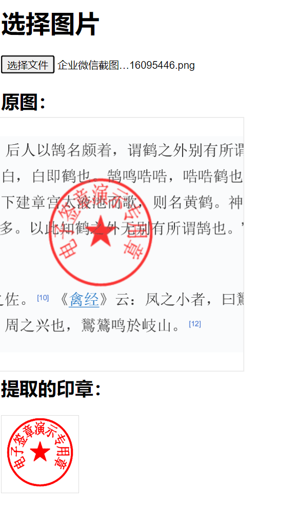

# extractstamp

Extract stamps from images using OpenCV.js.

##
Preview Site: https://xxss0903.github.io/extractstamp/index.html

## Features

- Extract red stamps from images
- Support for circular stamp detection and extraction
- Ability to set the color of the extracted stamp

## Usage Instructions

1. Clone or download this repository to your local machine.

2. Ensure your project includes the following files:
   - extractStamp.js
   - opencv.js (can be included via CDN, e.g., https://docs.opencv.org/4.x/opencv.js)

3. Click the "Choose File" button to select an image file containing a stamp.

4. The system will automatically process the image, extract the red stamp, and display the results.

## Main Function Description

- `initOpenCV(callback)`: Initialize OpenCV.js
- `extractStampWithFile(file, setColor, isCircle)`: Extract stamp from a file
  - `file`: Image file
  - `setColor`: Set the color of the extracted stamp (default is red "#ff0000")
  - `isCircle`: Whether to extract only circular stamps (default is true)

## Example
```js
extractStampWithFile(file, '#ff0000', true).then(dstImgList => {
    console.log('Red stamp extraction successful', dstImgList);
}).catch(error => {
    console.error('Error processing image:', error);
});
```


